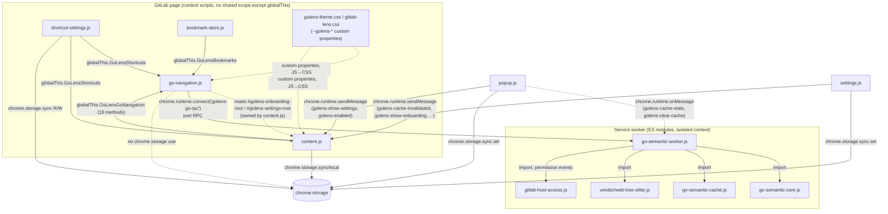

# Dependency map — the five legacy files

Raw material for ticket 03. Describes what exists today; does not propose target boundaries.

Scope: `go-navigation.js` (3096 lines), `content.js` (2118 lines), `go-semantic-core.js` (1354
lines), `go-semantic-cache.js` (550 lines), `go-semantic-worker.js` (351 lines). No bundler, no
shared module scope — `go-navigation.js`/`content.js` are non-module content scripts injected into
`https://gitlab.com/*` pages (manifest order: `shortcut-settings.js`, `bookmark-store.js`,
`go-navigation.js`, `content.js`); the other three are ES modules reachable only via `import`,
loaded as the MV3 background service worker (`go-semantic-worker.js`, `type: module`).

## 1. Graph

`go-semantic-core.js` and `go-semantic-cache.js` are leaves — neither imports anything, neither
uses `chrome.*`, neither touches the DOM. `go-semantic-worker.js` is the only thing that imports
them, and the only thing `go-navigation.js` talks to across the page/worker boundary.

## 2. File roles at a glance

| File | Context | Provides to others | Consumes from others |
|---|---|---|---|
| `go-navigation.js` | content script | `globalThis.GoLensGoNavigation` (19 methods + `__test`) | `GoLensShortcutCoach`, `GoLensBookmarks`, `chrome.runtime.connect` port |
| `content.js` | content script | nothing production (`GoLensContent.__test` only) | `GoLensGoNavigation`, `GoLensShortcuts`, `GoLensShortcutCoach`, `chrome.storage.sync/local`, `chrome.runtime.onMessage` from popup/settings |
| `go-semantic-worker.js` | MV3 service worker | RPC port `'golens-go-rpc'`, `chrome.runtime.onMessage` (cache stats/clear/host-access sync) | imports core + cache + tree-sitter + `gitlab-host-access.js` |
| `go-semantic-core.js` | ES module (leaf) | `GoSemanticIndex` class, `INDEX_FORMAT_VERSION` | nothing (only a duck-typed `parser` object passed into its constructor) |
| `go-semantic-cache.js` | ES module (leaf) | `GoSemanticSourceCache` class, `isCommitSHA` | nothing (only platform globals: `indexedDB`, `crypto.subtle`) |

`content.js` is a pure consumer of `go-navigation.js`; the reverse dependency is one-directional
except for one bidirectional DOM coupling (§4).

## 3. State that crosses file boundaries

### 3.1 `globalThis` properties (the only shared "module system")

- `globalThis.GoLensGoNavigation` — set by `go-navigation.js:3073-3095`, read by `content.js` at 16
  call sites (`init`, `teardown`, `preloadMergeRequest`, `mergeRequestPreloadStatus`,
  `mergeRequestCelebrationStatus`, `mergeRequestDiscussionStatus`, `preloadFullProject`,
  `fullProjectPreloadStatus`, `invalidateCacheState`, `runNavigationAction`,
  `offerShortcutCoach`, `subscribeBookmarks`, `revealBookmark`, `removeBookmark`,
  `clearBookmarks`, `recoverBookmark`).
- `globalThis.GoLensBookmarks` — set by `bookmark-store.js` (not in scope, but the contract point
  is `go-navigation.js:2970-2971` calling `.createStore()`, and `.hashText` at 2453/2680/2690).
- `globalThis.GoLensShortcuts` — only `content.js` reads it (975, 1937, 2029, 2056), for binding
  presets/merges/matching; `go-navigation.js` is not a consumer of this one.
- `globalThis.GoLensShortcutCoach` — read by both `go-navigation.js` (1422, 2206) and `content.js`
  (1948, 1932).
- `globalThis.GoLensContent` — set by `content.js:2115`, test-only, no production reader.

### 3.2 DOM as shared state

- `#golens-onboarding-root`, `#golens-settings-root` — **owned/created by `content.js`**
  (`showOnboarding`, `showSettingsOverlay`), **read by `go-navigation.js`**
  (`shortcutCoachBlocked`, line 2185-2186) to suppress a toast while either overlay is open. This
  is the one place `go-navigation.js` reaches into `content.js`'s DOM directly instead of going
  through `GoLensGoNavigation` — an implicit coupling that bypasses the otherwise one-directional
  API boundary (see §5, near-cycle).
- `document.documentElement.classList` (`gitlab-lens-review-focus`) — set and read only within
  `content.js`, but scoped to `<html>` itself rather than a shadow root, so it's page-global by
  construction.
- `--golens-*` CSS custom properties — consumed (not defined) by both files' shadow-DOM templates;
  supplied by `golens-theme.css`/`gitlab-lens.css` via the manifest's `content_scripts.css`. A
  JS→CSS-file dependency the JS-only framing of this ticket would otherwise miss.
- `data-golens-generated-hidden`, `data-golens-generated-file-row`, `data-golens-generated-folder`,
  `data-golens-go-test-file-row` — written by `content.js`, consumed by `gitlab-lens.css` (styling
  hook), not by another JS file.
- `golens-go-status` custom event — dispatched by `go-navigation.js:470` (`status(...)`) on every
  loading-progress update, **zero listeners anywhere in the repo**. Dead/orphaned contract.

### 3.3 `chrome.storage` keys

All four `sync` keys are genuinely multi-writer, confirmed by grepping every `chrome.storage.*.set(`
call site in the repo (not just the five files in scope):

| Key | Area | Written by | Read by |
|---|---|---|---|
| `enabled` | sync | `content.js:1832` (`setEnabled`, when `persist:true`), `popup.js:36`, `settings.js:299` (generic `data-setting` handler) | `content.js` (init, gates most features) |
| `hideGeneratedFiles` | sync | `content.js:1107` (onboarding save), `settings.js:299` | `content.js` (init, `onChanged`) |
| `shortcutCoachEnabled` | sync | `settings.js:299`, `shortcut-settings.js:249` | `content.js` (init only — never gates a `content.js` decision directly, just round-trips through `defaults`); actual gating reads happen in `shortcut-settings.js:210` |
| `shortcutBindings` | sync | `content.js:1107` (onboarding save), `settings.js:80,90,131` (three separate edit flows) | `content.js` (init, `onChanged`, re-derived via `GoLensShortcuts.mergeBindings`) |
| `golensOnboardingVersion` | local | `content.js:1360` | `content.js:1357` (`showFirstRunOnboarding`) — single-file, not shared |

`go-navigation.js` and all three semantic-index files use **zero** `chrome.storage` keys — their
persistence is entirely IndexedDB (`golens-go-semantic-index`, `golens-go-semantic-cache`) or the
in-page `state` object. `chrome.storage.onChanged` (area `sync`) is how `settings.js`/`popup.js`
writes propagate live into `content.js`. `shortcut-settings.js` is both a writer
(`shortcutCoachEnabled`) and an independent reader of `shortcutCoachEnabled`/`shortcutBindings` for
its own coaching logic — a third file layered onto what looks like a two-file (`content.js`↔
`settings.js`) relationship at first glance.

### 3.4 Message-passing payloads

**Port RPC `'golens-go-rpc'`** (`go-navigation.js` ↔ `go-semantic-worker.js`, the only
cross-context channel these five files use):
- Request: `{ id, method, params }`, sent from `go-navigation.js:588`.
- Response: `{ id, ok: true, result }` or `{ id, ok: false, error }`, from `go-semantic-worker.js:337-338`.
- `method` values: `cacheStats`, `prepareSources`, `projectCacheStatus`, `mergeRequestCacheStatus`,
  `packageCacheStatus`, `clearCache`, `indexPackage`, `indexProject`, `restorePackage`,
  `restoreProject`, `restoreMergeRequest`, `cachePackage`, `cacheProject`, `cacheMergeRequest`,
  `packageRelations`, `resolveDefinition`, `resolveHover`, `findReferences`,
  `findImplementations`, `disposeProject`.
- A second, structurally identical fallback transport exists in `go-semantic-worker.js:342-350`
  (`self.addEventListener('message')` / `self.postMessage`), reachable only when
  `chrome.runtime.onConnect` is absent — exercised solely by the worker's own test suite, not by
  any production caller. Two transports, one wire contract; a TS migration has to model this as
  one interface either way.

**`chrome.runtime.onMessage`** (extension-internal, popup/settings ↔ content.js, and popup ↔
worker):
- `content.js` handles (receive-only, no outbound `sendMessage`): `golens-enabled`,
  `golens-cache-invalidated`, `golens-preload-full-project`, `golens-full-project-status`,
  `golens-show-onboarding`, `golens-show-settings`, `golens-close-settings`,
  `golens-settings-ready`. Sender side (popup.js/settings.js) confirmed by cross-grep, not
  re-analyzed here (out of the five-file scope).
- `go-semantic-worker.js` handles: `golens-sync-host-access`, `golens-cache-stats`,
  `golens-clear-cache`, responding `{ ok, result }` / `{ ok: false, error }`.
- None of these payloads are schema-validated; `golens-enabled` doesn't even call `sendResponse`,
  unlike the other seven.

## 4. Cycles and near-cycles

- **`content.js` → `go-navigation.js` → `content.js`'s DOM.** `content.js` calls into
  `go-navigation.js` through the `GoLensGoNavigation` global (one direction, clean). But
  `go-navigation.js`'s `shortcutCoachBlocked` reads `#golens-onboarding-root`/`#golens-settings-root`
  directly off the page DOM — elements `content.js` owns — rather than asking `content.js` a
  question through an API. Not a true cycle (no call ever re-enters `content.js`'s functions), but
  a **near-cycle via shared DOM state**: `go-navigation.js` has two ways to observe `content.js`'s
  state (the API contract, and this DOM back-door), and only one of them is visible in the
  `GoLensGoNavigation` surface.
- **`go-semantic-worker.js`'s `dispatch`/`performDispatch` self-loop.** No cross-file cycle here,
  but worth flagging alongside the above: `restoreMergeRequest` (worker.js:224-262) can persist a
  partially-populated index mid-loop (early return at 243) whose completeness is then re-checked by
  a *later, separate* RPC call from `go-navigation.js` (`mergeRequestCacheStatus`) — i.e. the
  correctness of one RPC's result depends on bookkeeping state left behind by a previous RPC call,
  round-tripped through the port rather than returned directly.
- No cycle exists between the worker-side trio (`core`/`cache`/`worker`) — confirmed leaf/leaf/hub
  shape, no back-references.

## 5. Hub files

- **`go-navigation.js` is the dominant hub.** It is the sole bridge between the page (DOM,
  `content.js`, `bookmark-store.js`, `shortcut-settings.js`) and the worker (RPC), and it owns:
  hover/click semantic resolution, the popover UI, the "search complete project" modal, bookmark
  anchoring/recovery, occurrence highlighting, hunk/file keyboard navigation, and MR-scoped
  preloading — at least six largely-unrelated feature areas routed through one 3096-line file and
  one `state` object (`go-navigation.js:47-91`) with ~25 top-level fields.
- **`content.js` is a secondary hub** for page-lifecycle/UI-chrome concerns: onboarding, settings
  overlay, bookmark drawer, MR "mascot" celebration polling, generated-file hiding, full-file
  button mounting, and the extension-message dispatch table — again largely unrelated features
  sharing one file and one `state` object (`content.js:44-70`).
- **`go-semantic-worker.js` is a much smaller, cleaner hub** — it fans in tree-sitter, the cache,
  and `gitlab-host-access.js`, and fans out two RPC transports, but each responsibility is a single
  import with a narrow surface, not entangled shared state.
- `go-semantic-core.js` and `go-semantic-cache.js` are leaves, not hubs — no fan-in from each other,
  no fan-out beyond platform APIs.

## 6. Policy/infrastructure interleaving (representative; line ranges point at the whole interleaved function, not just the cited behavior)

| File | Function | What's interleaved |
|---|---|---|
| `go-navigation.js` | `preloadMergeRequest` (1043-1198) | "which packages/searches to run" decided and executed in the same pass — no separate plan step |
| `go-navigation.js` | `showResult` (1891-2046) | 11-way result-status branching directly mutates ~10 DOM nodes per branch |
| `go-navigation.js` | `recoverBookmark` (2700-2720) | eligibility check, network fetch, hash-match, and store write in one function |
| `content.js` | `reconcilePage` (1993-2019) | page-transition classification triggers DOM teardown, storage read, network calls, and onboarding side effects together |
| `content.js` | `setEnabled` (1824-1846) | on/off decision, `chrome.storage.sync.set`, DOM re-render, and four reconcile side effects in one body |
| `content.js` | `onNativeMergeRequestActionClick` (1814-1822) | click classification and celebration side effect fired together, no intermediate data structure |
| `go-semantic-worker.js` | `performDispatch` (168-302) | method routing fused with IndexedDB writes, in-memory index mutation, and rollback-on-error in the same branches |
| `go-semantic-worker.js` | `dispatch` (304-310) | queue-membership policy fused with the mutation-queue promise-chain mutation itself |
| `go-semantic-cache.js` | `prepareSources` (340-362) | "what's missing/invalid" decision triggers an inline delete side effect |
| `go-semantic-cache.js` | `clear` (386-401) | reads full stats purely to have a return value, immediately before destroying the data it just read |
| `go-semantic-core.js` | `indexPackage` (794-996) | every AST-walk classification decision (is this a func/method/struct field/interface?) appends directly into shared instance collections in the same statement |
| `go-semantic-core.js` | `resolve` (1186-1291) | symbol-classification policy silently lazy-mutates `file.tree`/`file.lines` caches as a side effect of being called |

## 7. Other findings worth carrying into ticket 03

- `defaultClock`/`setClock`/`debounceIdle` are independently duplicated (not shared) between
  `go-navigation.js` and `content.js` — same names, same logic, zero sharing.
- `go-semantic-core.js`'s `this._implementationCache` (a `Map`) is initialized in the constructor
  (572) and maintained in `clear()` (790, `.clear()`) and `disposeProject()` (1351, prefix-matched
  `.delete()`), but grepping the file confirms there is no `.set()` call anywhere — nothing ever
  populates it. The maintenance code runs against a map that is always empty; it looks like it was
  meant to memoize `findImplementations` (which recomputes everything on every call) but the write
  path was never wired up.
- `go-semantic-core.js`'s `_restorePackageEntry` fabricates partial fake tree-sitter nodes (only
  `startPosition` populated) when restoring from the durable index store; `findReferences`/`resolve`
  happen to only ever touch `.startPosition` on these, so it works, but a TS node-type contract will
  need to either narrow the type or treat this as a known gap.
- `go-semantic-cache.js`'s top-of-file comment describing `CACHE_FORMAT_VERSION`'s bump history is
  positioned over the wrong constant (`DATABASE_VERSION`) — a documentation nit, not a behavior bug.
