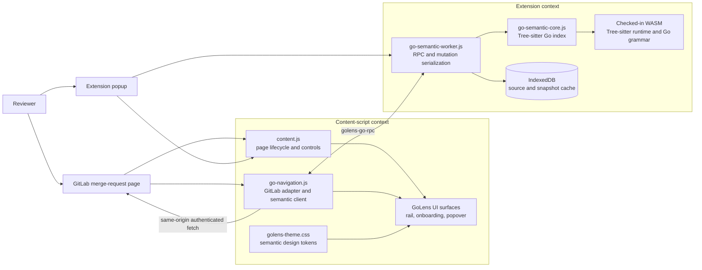

# GoLens for GitLab

## System Design

| Status | Owner | Last updated |
| --- | --- | --- |
| Implemented in the current working tree | Repository maintainers | July 17, 2026 |

| Document field | Value |
| --- | --- |
| Authors | Repository maintainers and implementation contributors |
| Reviewers | Maintainers and future implementing engineers |
| Related documents | [Application design review](docs/design/GoLens-design-review.docx), [README](README.md), [privacy policy](PRIVACY.md), [security policy](SECURITY.md) |
| Scope | Runtime and visual architecture for the GoLens Manifest V3 extension, including GitLab integration, Go semantic navigation, source caching, UI state, accessibility, and operational constraints. |

## 1. Abstract

GoLens for GitLab is a dependency-light Manifest V3 browser extension that adds Go-aware navigation and focused review tools to GitLab merge requests. It runs against GitLab.com and self-hosted GitLab, reads repository source through the user's signed-in same-origin session, parses Go locally with checked-in Tree-sitter assets, and stores commit-pinned source snapshots in browser IndexedDB. Repository source is not sent to an external service.

The extension has five user-facing surfaces: a three-button control rail mounted beside GitLab's AI-panel control, a first-run onboarding dialog, a compact toolbar popup, a large tabbed settings overlay, and a Go intelligence popover. These surfaces share a dependency-free semantic token layer while keeping their layout and state rules isolated. The design preserves GitLab's DOM ownership, Shadow DOM boundaries, native file search, current permissions, and all existing storage and messaging contracts.

The primary invariant is: **never navigate or cache speculatively**. Source identity must be tied to the GitLab origin, project, and immutable commit; ambiguous or unsupported semantic results remain explicit instead of being guessed.

## 2. Goals and Non-Goals

| Goals | Non-goals |
| --- | --- |
| Provide useful Go definitions, usages, signatures, documentation, and interface implementations directly from a merge-request diff. | Replace a full Go language server, compiler, or IDE. |
| Keep source access authenticated, same-origin, commit-pinned, local to the browser, and verifiable against Git blob identifiers. | Upload repository content, usage data, or analytics to a remote GoLens service. |
| Survive GitLab Turbo/PJAX navigation and DOM replacement without duplicate controls or stale sessions. | Own or rewrite GitLab's navigation, diff renderer, file browser, or theme. |
| Present a consistent GitLab-native visual language across popup, settings, rail, onboarding, and semantic popover while preserving surface-specific density. | Introduce a UI framework, runtime design-system dependency, remote font, or remote image. |
| Expose deterministic busy, success, error, disabled, focus, and pressed feedback without changing behavioral state contracts. | Persist visual-only state or introduce a second state machine in CSS. |
| Preserve accessible keyboard operation, focus restoration, status announcements, and reduced-motion behavior. | Guarantee support for semantic cases that the local parser cannot resolve safely, including ambiguous symbols, dot imports, and unresolved build-constraint variants. |

## 3. Background and Problem Statement

GoLens injects into every HTTP(S) page so that it can support self-hosted GitLab instances. The broad match is constrained at runtime: `content.js` checks for a GitLab shell and only activates merge-request behavior on an individual merge-request URL. Controls are mounted immediately after GitLab's AI-panel button; if that anchor is unavailable, GoLens waits for it and never falls back to the document body.

GitLab can replace the active merge request without reinjecting the content scripts. The extension therefore has to reconcile page identity, controls, generated-file handling, full-file actions, keyboard shortcuts, onboarding, cache state, and Go navigation after DOM mutations, history changes, Turbo events, PJAX events, focus changes, and storage changes.

The semantic path also crosses multiple browser boundaries. The content-side navigation module extracts the project, file, side, line, and commit from GitLab's current and legacy diff DOM. It fetches source with the user's GitLab session, while a Manifest V3 service worker owns parsing, semantic indexing, and durable cache access. The design must tolerate service-worker restarts and partial caches without navigating to stale or unverified source.

The visual redesign addressed a separate consistency problem. The popup, onboarding, control rail, popover, and global focus rules had independent palettes, typography, assets, radii, shadows, and interaction states. The implemented token layer now connects those surfaces without weakening their Shadow DOM isolation or altering application behavior.

## 4. Proposed Architecture

The current implementation uses three runtime layers and one shared presentation contract.

Figure 1. GoLens keeps GitLab integration in the page, semantic work in the extension service worker, and durable source snapshots in local browser storage.

### Core components

| Component | Responsibility | Primary state or dependency | Failure behavior |
| --- | --- | --- | --- |
| `shortcut-settings.js` | Define portable shortcut actions, GoLens/VS Code/IntelliJ/Vim-style presets, normalization, display labels, matching, duplicate reassignment, and the contextual shortcut coach. | `chrome.storage.sync.shortcutBindings`, `chrome.storage.sync.shortcutCoachEnabled`, `chrome.storage.local.golensShortcutCoach`, platform modifier conventions | Invalid stored entries fall back to defaults; explicitly cleared actions stay unassigned; presets remain editable after application; tips are session-throttled and retire after successful shortcut use. |
| `bookmark-store.js` | Validate, isolate, persist, clear, and safely replace versioned MR-local bookmark records. | One `chrome.storage.local` key per bookmark, scoped by origin, project, MR, and head commit | Rejects invalid records; writes recovered state before deleting stale state; never stores source excerpts. |
| `content.js` | Detect GitLab merge requests; mount and reconcile controls; own focus mode, onboarding, the settings-overlay host, confirmed review celebrations, generated-file behavior, full-file actions, and shortcut dispatch; bridge extension-page messages to the active tab. | GitLab DOM, `chrome.storage.sync`, `chrome.storage.local` | Leaves non-GitLab and non-MR pages untouched. Suppresses shortcuts in editors, searches, and dialogs. Waits for the exact mount anchor and tears down page state when the MR changes or GoLens is disabled. |
| `go-navigation.js` | Adapt GitLab diff DOM to semantic inputs; fetch GitLab trees, blobs, diffs, approval and discussion state, and search results; manage progress; render Go popovers; open exact destinations. | Signed-in GitLab session, active MR refs, long-lived worker port | Aborts fetches and rejects pending RPCs on teardown. Shows explicit errors or missing/ambiguous results instead of guessing. |
| `go-semantic-worker.js` | Initialize Tree-sitter, dispatch semantic RPC, serialize mutations, restore durable snapshots, and handle cache statistics and clearing. | `go-semantic-core.js`, `go-semantic-cache.js`, checked-in WASM | Rejects unknown methods. Resets failed parser initialization for retry. Serializes cache/index mutations so clearing cannot race writes. |
| `go-semantic-core.js` | Build an in-memory, DOM-independent Go symbol and identifier-candidate index; resolve definitions, references, documentation, and implementations. | Tree-sitter syntax trees and indexed package/project snapshots | Returns typed `notFound`, `ambiguous`, `needsPackage`, or unsupported results when evidence is insufficient. |
| `go-semantic-cache.js` | Persist, validate, restore, count, and clear immutable source blobs plus package, project, and MR manifests. | IndexedDB database `golens-go-semantic-cache`, format version 3 | Verifies cached source against Git blob IDs, deletes corrupted records, and treats incomplete manifests as misses. Falls back to process memory if IndexedDB is unavailable. |
| `popup.*` | Provide compact global enablement, active-project cache status, full-project caching, and entry to the settings overlay. | Storage, active-tab messages, worker runtime messages | Shows unavailable or error state when no supported GitLab tab or worker response is available. |
| `settings.*` | Render the tabbed extension settings inside an isolated iframe overlay; manage preferences, shortcuts, host access, cache lifecycle, and onboarding replay. | Storage, optional permissions, active-tab messages, worker runtime messages | Keeps permission prompts in an extension context and reports unavailable active-tab operations explicitly. |
| `golens-theme.css` | Define shared neutral surfaces, semantic accents, type stacks, spacing, radii, shadows, motion, and stacking tokens. | CSS custom properties scoped to GoLens roots and popup `:root` | Surface CSS retains no behavioral authority; absent states remain controlled by DOM and ARIA attributes. |
| `gitlab-lens.css` | Apply focus mode and GitLab-adjacent affordances that cannot live inside a Shadow DOM. | GitLab page DOM and shared tokens | Uses narrowly scoped selectors and fallbacks; never injects a standalone floating control. |

Bookmark review surfaces register an adapter with selection extraction, marker reconciliation, location revelation, and recovery-candidate discovery. The GitLab diff is the first adapter; future GoLens-owned Split View and folding surfaces must use the same contract and reveal hidden destinations before scrolling.

## 5. Request Lifecycle

### Page initialization and reconciliation

1. Chrome injects `go-navigation.js`, `content.js`, `golens-theme.css`, and `gitlab-lens.css` at `document_idle`.
2. `content.js` validates that the page is GitLab and that the URL belongs to an individual merge request.
3. The page key combines the origin and merge-request path. A changed key causes the previous session to tear down before the new one starts.
4. GoLens mounts the control rail after GitLab's AI-panel button, restores synced preferences, starts Go navigation if enabled, captures the current MR approval and merge baseline, checks cache status, and shows first-run setup once per installation. Setup stages a keymap preset and generated-file preference, then persists both together only on completion. Help replay opens the separate complete feature reference.
5. Mutation, history, Turbo, PJAX, visibility, focus, fullscreen, and storage events schedule idempotent reconciliation. Repeated reconciliation updates existing elements instead of duplicating them.

### Mascot review moments

1. Review focus swaps the rail mascot to its goggle variant for as long as focus mode is active. A successfully completed related or full-project cache shows the pitstop moment.
2. `content.js` observes clicks on GitLab's native approval, merge, and resolve-discussion controls without replacing or blocking them. Short polling windows read authenticated approval and discussion state through `go-navigation.js`.
3. An approval reacts only when a new approver appears. A merge reacts only when the MR changes from an unmerged state to `merged`. The clipboard moment requires the unresolved-discussion count to move from at least one to zero.
4. On Friday after 16:00 local browser time, confirmed approvals and merges use an extended beer-kart lap with a staggered confetti field. Clicking GitLab's create-MR control stores a same-project, two-minute session marker that is consumed only after navigation reaches the newly created numeric MR URL.
5. The pointer-transparent Shadow DOM overlay removes itself after the mascot moment, waits behind first-run onboarding, is cancelled during teardown, and uses a static presentation when reduced motion is requested.

### Symbol hover and navigation

Plain-clicking a Go token records a loaded-diff text selection and paints identifier-boundary matches through the CSS Custom Highlight API. A mutation observer refreshes ranges as Rapid Diffs streams content. Shortcut actions traverse those occurrences, explicit or inferred hunks, and loaded file roots without modifying GitLab's code DOM. The `semanticJump` action (`Cmd/Ctrl+F12` by default) rebuilds the exact pointer target for the selected occurrence and uses the same safe definition, usage, or implementation resolver as modifier-click.

In-diff semantic jumps record their exact source and destination in a bounded, per-MR memory history. Back and forward reveal collapsed target lines when possible; leaving the MR or disabling GoLens clears selection and history. New-tab destinations remain browser history only.

1. Pointer or modifier-click input is accepted only while GoLens is enabled on a merge request and the target belongs to a supported Go diff cell.
2. `go-navigation.js` derives the file path, old/new side, line, rendered identifier occurrence, project, and immutable ref from GitLab's DOM and MR metadata.
3. The module checks the in-memory index and durable package/project cache through `golens-go-rpc`. Missing packages are discovered through GitLab's paginated repository APIs and fetched with `credentials: include`.
4. Source blobs are keyed by Git blob ID. The worker writes source and a complete manifest before it indexes the snapshot.
5. Tree-sitter builds or restores the relevant package namespace. Production packages and external `_test` packages remain separate semantic namespaces.
6. Hover returns a compact signature, documentation, or usages. Modifier-click opens an exact in-diff line, a commit-pinned GitLab tree/blob destination, or versioned Go documentation. Multiple or ambiguous results remain in the popover for user choice.
7. Teardown aborts in-flight fetches, rejects pending RPCs, disconnects the worker port, clears transient maps, removes event listeners, and removes the popover host.

### Related and full-project caching

1. Related caching starts with packages changed by the merge request.
2. Direct imports are loaded next. A bounded candidate search may load likely usages or implementations; it is limited to 8 search queries, 10 candidate packages, and 2 search pages per query.
3. Full-project caching enumerates eligible `.go` files recursively, excluding `vendor` and `testdata`, then fetches missing immutable blobs with concurrency limited to six requests.
4. GitLab pagination uses `X-Next-Page` when available and a 100-entry fallback when the header is absent.
5. A package containing more than 200 Go files fails explicitly rather than creating a partial semantic namespace.
6. Completion is published only after every referenced package or project entry can be restored and verified. Progress moves through stable phases and uses determinate percentages when totals are known.

### Popup and settings actions

1. The compact popup reads global enablement, cache statistics, and full-project status from the active tab.
2. Its gear sends `golens-show-settings` to the active GitLab content script, which mounts `settings.html` in a full-viewport Shadow DOM backdrop.
3. The settings iframe remains an extension context, so optional host permission requests stay directly tied to settings controls while GitLab cannot inspect or style the settings document.
4. Global enablement and generated-file preferences are stored in `chrome.storage.sync`; storage listeners update every open tab and extension surface.
5. Full-project caching runs in the active MR tab because the tab owns the signed-in GitLab origin and fetch context.
6. Cache statistics and clearing are sent directly to the service worker. Clearing invalidates the active tab's transient cache state after durable deletion succeeds.
7. Onboarding replay is sent from the Help settings page and succeeds only on a supported GitLab merge request.

## 6. API and Data Contracts

### Worker RPC envelope

The long-lived port is named `golens-go-rpc`.

| Field | Type | Required | Description |
| --- | --- | --- | --- |
| `id` | number | Yes | Monotonic client request identifier used to match a response. |
| `method` | string | Yes | One of the worker dispatch methods. Unknown methods fail explicitly. |
| `params` | object | No | Method-specific inputs. Semantic and cache operations normally include origin, project, ref, and package or file identity. |
| `ok` | boolean | Response | Indicates whether `result` or `error` is present. |
| `result` | any | Successful response | Method-specific result object. |
| `error` | string | Failed response | User-safe error message derived from the rejected operation. |

Normal semantic RPC has a 20-second client timeout. Project indexing, cache preparation/restoration, and cache-status operations use a 120-second timeout. Disconnecting the port rejects every pending request and clears content-side project/package tracking.

### Worker methods

| Group | Methods | Contract |
| --- | --- | --- |
| Index and restore | `indexPackage`, `indexProject`, `restorePackage`, `restoreProject`, `restoreMergeRequest`, `disposeProject` | Restore returns `memoryHit`, `cacheHit`, or `cacheMiss`; durable restore requires a full commit SHA. |
| Cache lifecycle | `prepareSources`, `cachePackage`, `cacheProject`, `cacheMergeRequest`, `packageCacheStatus`, `projectCacheStatus`, `mergeRequestCacheStatus`, `cacheStats`, `clearCache` | A complete status requires every manifest entry and source blob to be present and valid. Mutating methods are serialized. |
| Semantic queries | `resolveDefinition`, `resolveHover`, `findReferences`, `findImplementations`, `packageRelations` | Queries wait behind pending mutations, carry their exact package/full-project search scope, and return explicit typed states instead of speculative navigation. References and implementations use stable 25-result cursor pages. |
| Complete result search | Exhaustive commit-pinned GitLab basic code search followed by targeted package indexing | Usage searches query the identifier; implementation searches query every required method name. Coverage becomes complete only when every search page and candidate package succeeds. Cancellation or unavailable/limited search preserves incomplete coverage. |

### Storage contract

| Store or key | Scope | Identity | Purpose |
| --- | --- | --- | --- |
| `chrome.storage.sync.enabled` | Browser profile | Setting name | Global GoLens enablement, synchronized to all open tabs. |
| `chrome.storage.sync.hideGeneratedFiles` | Browser profile | Setting name | Whether GitLab-marked generated files are hidden. |
| `chrome.storage.local.golensOnboardingVersion` | Installation | Setting name | Records which onboarding version has been shown. |
| `chrome.storage.local.golensBookmark:v1:*` | Origin, project, MR, and head commit | Version, scope, bookmark ID | Minimal line/range locations and bounded SHA-256 context fingerprints for local bookmark restoration. |
| IndexedDB `sources` | Origin and project | Cache format, origin, project, Git blob ID | Deduplicated immutable source text and byte count. |
| IndexedDB `packages` | Commit and package | Cache format, origin, project, ref, package path | Complete package manifest pointing to immutable source blobs. |
| IndexedDB `projects` | Commit, or MR and commit | Cache format, origin, project, ref; MR manifests additionally include MR IID | Complete project snapshots and related-MR coverage manifests. |

Cache format and database versions are both 3. A durable cache identity requires a full commit SHA. Source records are hashed with SHA-1 or SHA-256 according to the Git blob identifier length and are removed if the computed ID differs.

### UI state contract

UI state is a projection of existing behavior. CSS does not create or persist application state.

| State | DOM contract | Visual contract |
| --- | --- | --- |
| Idle | Default attributes or `data-state="idle"` | Neutral panel/control surface. |
| Hover | CSS `:hover` | Raised neutral surface and stronger border or text. |
| Focus | CSS `:focus-visible` | Shared cyan focus ring with visible offset. |
| Pressed | CSS `:active` or `aria-pressed="true"` | Pressed surface; persistent toggles also receive semantic accent treatment. |
| Disabled | Native `disabled` | Reduced emphasis and non-interactive cursor. |
| Busy | `aria-busy="true"`, disabled where needed, and busy `data-state` | Stable geometry, progress feedback, tabular figures, and progress cursor. |
| Success | Terminal success `data-state` | Green semantic treatment and explicit status copy. |
| Error | Error `data-state` | Red semantic treatment, explicit copy, and retryable control where the operation permits it. |

The shared token source is `golens-theme.css`. System UI fonts are used for interface text, a system monospace stack is used for code and metrics, orange identifies primary GoLens actions, cyan identifies focus and information, and green/red identify terminal outcomes. Go syntax-kind colors remain semantic popover concerns rather than brand tokens.

## 7. Consistency, Idempotency, and Replay

| Scenario | Expected behavior | Reasoning |
| --- | --- | --- |
| Repeated DOM reconciliation | Reuse or remount one control host, reconcile existing GitLab additions, and avoid duplicate buttons or listeners. | GitLab may replace fragments without reinjecting scripts. Page identity and idempotent DOM queries bound the work. |
| Merge request changes in the same tab | Tear down the previous session, abort its work, clear transient state, then initialize the new page key. | Results and requests from one MR must never bleed into another. |
| Duplicate package/project load | Reuse an in-flight content-side promise, an in-memory index, or a verified durable snapshot. | Immutable ref and package identity make work safely reusable. |
| Service worker disconnect or restart | Reject pending RPC, clear transient content-side maps, reconnect on the next request, and restore from IndexedDB where possible. | Durable snapshots are the recovery boundary; the in-memory index is disposable. |
| Cache clear races a write | Serialize both operations through the worker mutation queue. | The cache and semantic index must not report completion from a write that was concurrently deleted. |
| Cached source is missing or corrupt | Purge or reject the invalid source and report a cache miss/incomplete snapshot. | Navigation must not use content that fails Git blob verification. |
| Configuration changes during work | Synced settings update mounted tabs; disabling GoLens invalidates active run identifiers and tears down semantic navigation. | Run IDs and lifecycle teardown prevent late completion from restoring obsolete UI state. |
| GitLab omits pagination headers | Continue only while a full 100-entry page is returned; stop on a shorter page. | This preserves compatibility with GitLab responses that omit `X-Next-Page` without hiding truncation behind a single-page assumption. |

Transient hover, pressed, focus, and progress state may reset on reload. Enablement, generated-file preference, onboarding version, and verified cache completion retain their current storage behavior.

## 8. Security and Privacy Considerations

- Source requests stay on the active GitLab origin and use the user's existing signed-in session. GoLens does not introduce tokens or credentials.
- Source and semantic snapshots are separated by origin, project, and immutable ref. Blob reuse is limited to the same origin and project.
- Commit-pinned destinations are preferred. Durable caching rejects mutable or malformed refs.
- Repository content stays within the GitLab page, extension contexts, in-memory index, and local IndexedDB. There is no analytics or repository-content upload path.
- Checked-in Tree-sitter JavaScript, WASM, and Go grammar assets run under the extension content security policy. Fonts, icons, and design tokens ship locally.
- The manifest permissions remain `storage` and `unlimitedStorage`, with HTTP(S) host access required for GitLab.com and unknown self-hosted GitLab origins. Runtime GitLab detection limits where UI and behavior activate.
- Cache clearing is user initiated and removes durable source snapshots plus the in-memory semantic index. Visual state creates no additional stored data.
- Missing or ambiguous semantic evidence fails safely. GoLens does not navigate speculatively through uncertain symbol relationships, build constraints, dot imports, or unresolved interface embeddings.
- Onboarding remains an ARIA modal with focus trapping, Escape dismissal, background dismissal, and focus restoration. Controls retain accessible names, live status regions, focus-visible rings, and reduced-motion behavior.

## 9. Operational Readiness

GoLens has no remote backend or runtime telemetry service. Operational readiness is therefore established through deterministic local tests, browser-injection tests, manual extension loading, user-visible status, and release packaging inspection.

| Signal | Current gate | Owner | Launch gate |
| --- | --- | --- | --- |
| Syntax and unit behavior | `npm run check:syntax` and all `node:test` suites pass. Current verified baseline: 99 tests. | Maintainers | Required |
| Real extension injection | `npm run test:browser` loads the unpacked extension in Chrome against a local GitLab fixture and exercises mounting, focus, caching, navigation, and popovers. | Maintainers | Required |
| Visual contract | Popup, onboarding, rail, popover, focus, busy, success, error, constrained width, and reduced-motion states are inspected when their CSS changes. | Maintainers | Required for user-facing releases |
| Package integrity | `npm run package` produces a ZIP containing the manifest, shared theme, runtime code, optimized icons, notices, and checked-in parser assets. | Maintainers | Required |
| Cache integrity | Unit tests cover origin/ref isolation, blob verification, snapshot completeness, clear/write serialization, and restoration. | Maintainers | Required |
| GitLab compatibility | Happy DOM fixtures cover legacy and Rapid Diffs shapes; the browser smoke test covers real extension injection and mount placement. | Maintainers | Required |

There is no numeric production SLO because no server-side service is operated. User-visible errors are surfaced through control status, popover messages, and retryable actions. Browser DevTools and the reproducible local fixture are the primary diagnostic tools.

Release sequence:

1. Run `npm run check` with a supported Chrome binary.
2. Inspect representative UI states, including reduced motion and narrow viewports.
3. Run `npm run package` and inspect the archive for expected assets and notices.
4. Load the repository or packaged artifact as an unpacked extension and validate against a supported GitLab merge request.
5. Publish through the repository's tag-driven release workflow only from the intended release branch.

## 10. Alternatives Considered

| Alternative | Why it was considered | Why it was not selected |
| --- | --- | --- |
| Remote language service or hosted Go LSP | Could provide broader compiler-grade semantic coverage and reduce local parsing work. | Would upload repository content, require authentication and operations, increase privacy risk, and violate the local-first boundary. |
| Run all parsing in the content script | Would remove the worker RPC boundary. | Heavy parsing and cache work would share the GitLab page's execution context, durable recovery would be weaker, and teardown/service isolation would be harder. |
| Mount controls on `document.body` when GitLab's AI rail is absent | Would make controls appear sooner on unknown GitLab variants. | A misplaced floating control is worse than delayed mounting and would break the GitLab-native placement invariant. |
| Use large mascot artwork for operational actions | Creates strong brand visibility with little icon-design work. | Character imagery is ambiguous for focus/cache actions, visually inconsistent at 32 px, and unnecessarily expensive to decode. Mascot use is limited to identity-bearing moments. |
| Keep each surface's independent visual system | Avoids a shared token file and minimizes immediate CSS edits. | Produces fragmented typography, state feedback, radii, shadows, and semantic colors across one product. |
| Adopt a UI framework or CSS-in-JS runtime | Could centralize components and tokens. | Adds runtime weight, build complexity, and integration risk to a dependency-light extension whose surfaces are small and intentionally isolated. |
| Immediately inherit GitLab theme variables | Could visually blend with every GitLab theme. | Host token names and availability are not stable across GitLab versions and self-hosted instances. GoLens currently uses a stable isolated dark surface with restrained GitLab-compatible styling. |

## 11. Open Questions

These questions do not block the current implementation, but they guide future changes:

1. Can a tested adapter safely consume stable GitLab theme tokens across GitLab.com and supported self-hosted versions without weakening isolation?
2. Should visual approval screenshots become checked-in regression fixtures, or remain release-review artifacts outside the repository?
3. Should cache retention gain an explicit age or size policy beyond user-triggered clearing and browser storage management?
4. Which additional build-constraint or import cases can be supported without weakening the explicit missing-or-ambiguous guarantee?

## 12. Decision and Next Steps

The selected design is a local-first, GitLab-native extension with restrained GoLens branding, same-origin source access, a worker-owned semantic index, verified commit-pinned cache snapshots, and shared dependency-free design tokens.

| Milestone | Deliverable | Exit criteria | Status |
| --- | --- | --- | --- |
| M1 | Shared tokens, system typography, semantic focus/preload icons | Every GoLens surface consumes the shared contract; no remote font or operational raster icon remains. | Implemented |
| M2 | Compact popup and tabbed settings hierarchy | Active-project caching stays immediate while preferences, shortcuts, host access, storage, and help use a large isolated overlay with tested busy/success/error states. | Implemented |
| M3 | Vertical onboarding and aligned semantic popover | Responsive workflow, accessible dialog behavior, tokenized popover surfaces, and preserved syntax semantics pass tests. | Implemented |
| M4 | Asset optimization, obsolete CSS removal, and regression coverage | Runtime uses display-sized icons, obsolete focus CSS is removed, 99 unit tests and the Chrome injection smoke pass, and the package contains expected assets. | Implemented |

Future work should preserve the contracts in this document. Any change to permissions, source boundaries, storage identity, worker messages, semantic failure behavior, or GitLab mounting is an architecture change and should update this document alongside code and tests.
