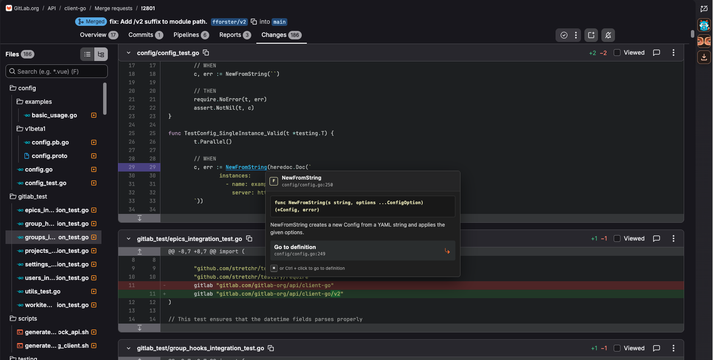
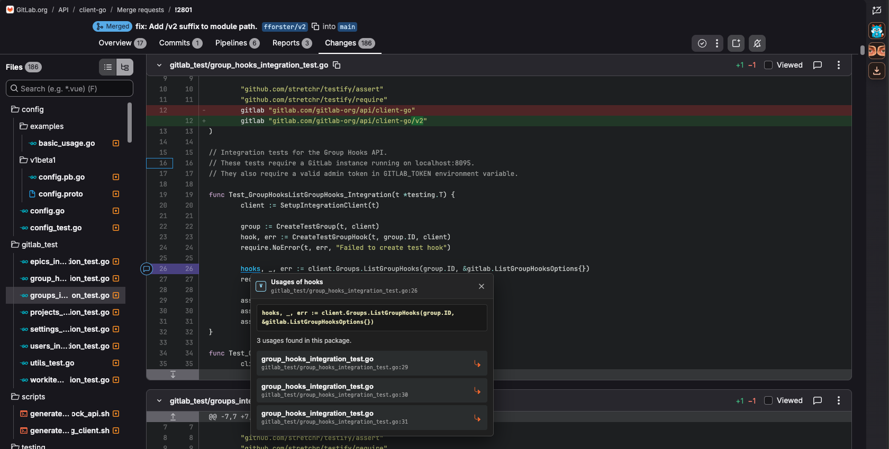

# GoLens for GitLab™

> This extension is not affiliated, endorsed, sponsored, or approved with or by GitLab Inc.
>
> GITLAB is a trademark of GitLab Inc. in the United States and other countries and regions

<p align="center">
  <strong>A calmer, Go-aware code review experience for GitLab.</strong><br>
  Navigate symbols, find interface implementations, and focus on the diff without sending repository code anywhere.
</p>


GoLens for GitLab is a dependency-light Manifest V3 extension for GitLab.com and self-hosted GitLab. It reads source through your signed-in GitLab session and runs its Go intelligence entirely inside the browser.

## Highlights

- Hover Go identifiers for signatures and documentation.
- `Cmd/Ctrl`-click to find definitions, usages, and interface implementations.
- Select a Go identifier and press `Cmd/Ctrl+F12` by default for the same definition or implementation navigation.
- Plain-click a Go identifier to highlight its loaded-diff occurrences, then move between occurrences, hunks, and files with configurable shortcuts.
- Go back and forward through in-diff semantic jumps without leaving the merge request.

Navigation defaults follow familiar editor patterns: `Cmd/Ctrl+Alt+↑/↓` for occurrences, `Shift+Alt+F5`/`Alt+F5` for hunks, `Alt+Page Up/Down` for files, and `Ctrl+-`/`Ctrl+Shift+-` for semantic history. Settings can apply GoLens, VS Code, IntelliJ IDEA, or Vim-style keymaps before changing or clearing individual bindings; the Vim preset adds shortcuts only, not modal behavior.

First-run setup asks which keymap to use and whether GitLab-marked generated files should be hidden, then teaches four essential interactions. The complete feature reference remains available from Settings under Help.

- Enter review focus to hide GitLab chrome and give the diff more room.
- Cache related packages or the full project for broader navigation.
- Let the mascot mark review focus, a completed cache pitstop, the final resolved discussion, confirmed approvals and merges, plus an extra-long Friday-after-16:00 beer-kart lap with confetti.
- Keep source local, same-origin, and pinned to the merge-request commit.

GoLens teaches the highest-value bindings with contextual shortcut tips after the equivalent mouse action. Tips are limited to one per review session with a 24-hour cooldown, stop after the shortcut is used, and can be disabled or re-enabled in General settings. Learning progress stays in local extension storage while the preference and configured bindings use Chrome sync.

## In action

### Hover and jump to definitions



### Find usages without leaving the diff



## Install

1. Clone this repository.
2. Open `chrome://extensions` and enable **Developer mode**.
3. Choose **Load unpacked** and select the repository folder.
4. Refresh a GitLab.com merge-request Changes page.

The three-button control appears beside GitLab's AI-panel button. The compact toolbar popup controls global enablement and full-project caching. Use its gear button to open the large tabbed settings overlay on GitLab, where you can configure shortcuts, approve self-hosted origins, manage cached source, or replay the quick tour. After approving a self-hosted HTTP(S) origin, refresh its merge-request page.

## Development

```sh
npm install
npm run check
```

The extension deliberately favors safe, browser-native Go navigation over speculative results: missing or ambiguous symbols do not navigate.

## Legal

GoLens is available under the [MIT License](LICENSE). See the
[privacy policy](PRIVACY.md), [security policy](SECURITY.md), and
[third-party notices](THIRD_PARTY_NOTICES.md) for more information.
